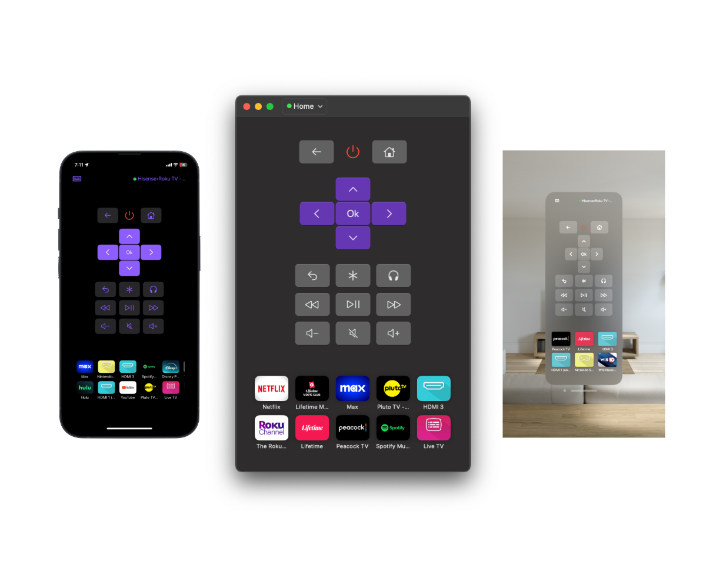

# Roam

A Roku remote that puts users first

## Features

-   Runs on Mac, iPhone, iPad, Apple Watch, Vision Pro or Apple TV!
-   Smart platform integration with keyboard shortcuts on Mac, using hardware volume buttons to control TV Volume on iOS
-   Use shortcuts and widgets to control your TV without ever opening the app!
-   Headphones mode (a.k.a. private listening) support on Mac, iPad, iPhone, VisionOS, and Apple TV (play the audio from your TV through your device)
-   Discover devices on your local network as soon as you open the app
-   Intuitive design with apple's native SwiftUI design system
-   Fast and lightweight, less than 8 MB on all devices and opens in less than half a second!

## How to Use

-   Open in Xcode 15.3 or later
-   Run on iOS, macOS, watchOS, VisionOS, iPadOS, or tvOS

**_OR_**

-   Download on the app store [here](https://apps.apple.com/us/app/roam/6469834197)

## License

&copy; 2024 Scott Driggers.

This project is licensed under either of

-   [Apache License, Version 2.0](https://www.apache.org/licenses/LICENSE-2.0) ([`LICENSE-APACHE`](LICENSE-APACHE))
-   [MIT license](https://opensource.org/licenses/MIT) ([`LICENSE-MIT`](LICENSE-MIT))

at your option.

The [SPDX](https://spdx.dev) license identifier for this project is `MIT OR Apache-2.0`.
