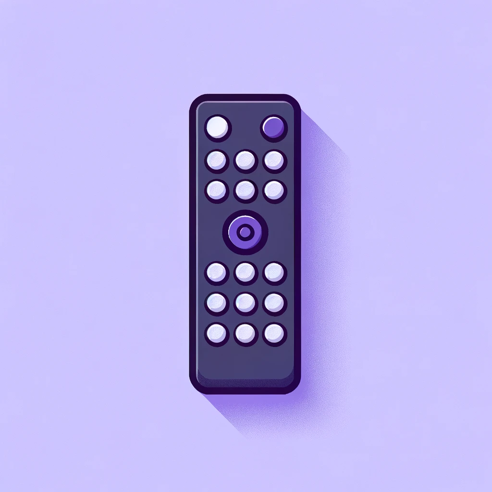
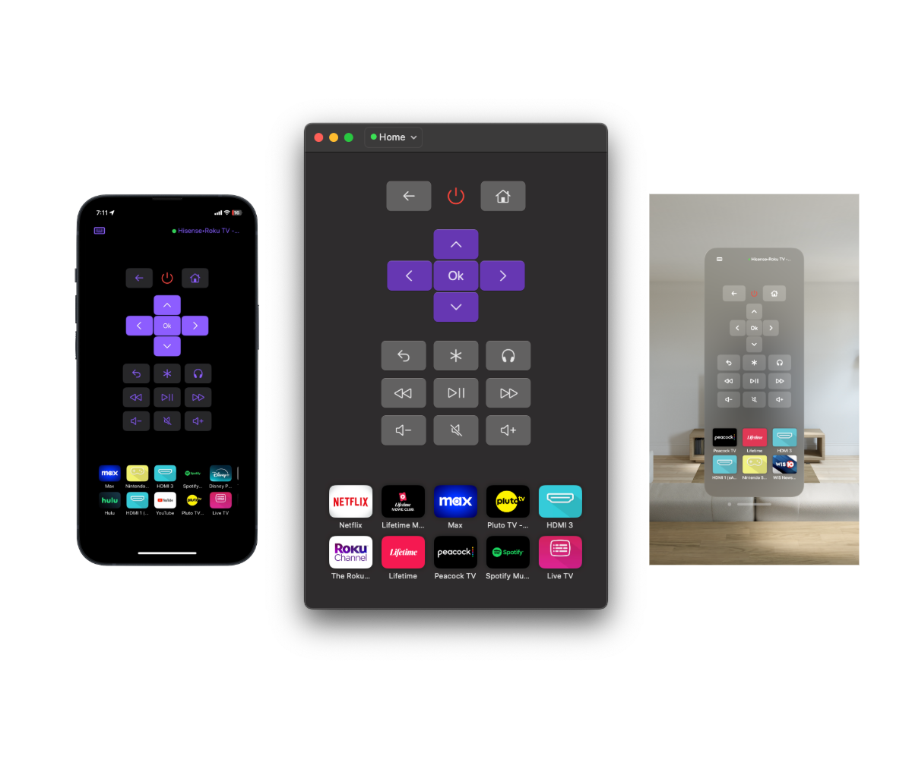

# Roam

A Roku remote that puts users first

## Features

-   Runs on Mac, iPhone, iPad, Apple Watch, Vision Pro or Apple TV!
-   Smart platform integration with keyboard shortcuts on Mac, using hardware volume buttons to control TV Volume on iOS
-   Use shortcuts and widgets to control your TV without ever opening the app!
-   Headphones mode (a.k.a. private listening) support on Mac, iPad, iPhone, VisionOS, and Apple TV (play the audio from your TV through your device)
-   Discover devices on your local network as soon as you open the app
-   Intuitive design with apple's native SwiftUI design system
-   Fast and lightweight, less than 8 MB on all devices and opens in less than half a second!

## How to Use

-   Open in Xcode 15.3 or later
-   Run on iOS, macOS, watchOS, VisionOS, iPadOS

**_OR_**

-   Download on the app store [here](https://apps.apple.com/us/app/roam/6469834197)

## Read More

-   Blog post announcing Roam [here](https://scottdriggers.com/blog/roam-roku-remote)
-   Blog post going into some implementation details and decisions [here](https://scottdriggers.com/blog/how-i-built-roam/)
-   Blog post about the developer-messaging functionality [here](https://scottdriggers.com/blog/discord-based-in-app-messaging)

## License

&copy; 2023&ndash;2026 Scott Driggers. All rights reserved.

Roam is **source-available**, not open source. It is licensed under the
[PolyForm Noncommercial License 1.0.0](https://polyformproject.org/licenses/noncommercial/1.0.0)
([`LICENSE.txt`](LICENSE.txt)):

-   **Free for any noncommercial purpose.** You may use, modify, distribute, and
    build on Roam for noncommercial use — personal projects, research, education,
    and noncommercial organizations — provided you keep the `Required Notice:`
    copyright line and a copy of the license with any copies you share.
-   **Commercial use requires a separate license.** The PolyForm Noncommercial
    license does not grant any commercial use. Publishing an app based on Roam,
    redistributing it commercially, or any for-profit use requires a separate
    commercial license (which may carry a fee or royalty). To obtain one, contact
    **scott@msd3.io**.

Third-party components bundled with Roam remain under their own licenses. The
"Roam" name, logo, and icon are trademarks of Scott Driggers and are not
licensed for reuse.

The SPDX license identifier for this project is `PolyForm-Noncommercial-1.0.0`.
